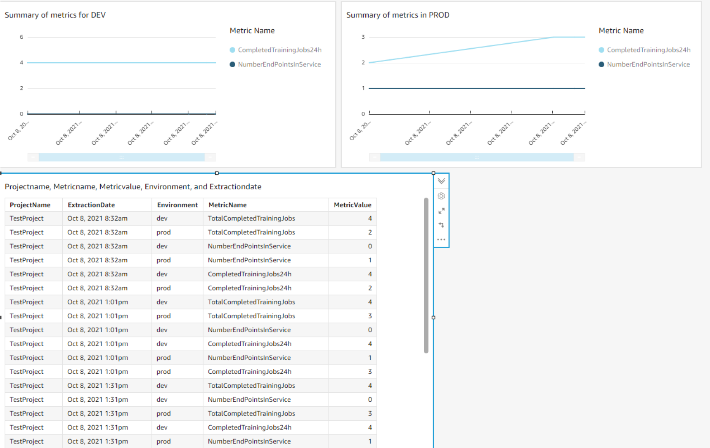

# A lightweight, hub-and-spoke dashboard for cross-account Data Science Projects

## Introduction

Modern Data Science environments often involve many independent projects, each spanning multiple accounts.
In order to maintain a global overview of the activities within the projects, a mechanism to collect data from the different accounts into a central one is crucial.

In this example code, we show how one can leverage existing services (Amazon DynamoDB, AWS Lambda, Amazon EventBridge) to deploy a very lightweight infrastructure that allows the flow of relevant metrics from one or more Spoke accounts to one (or more) Hub accounts.

The quantities being monitored are called Metric in the following. We will focus here on scalar metrics (i.e. numbers, not vectors). Extension to multi-dimensional metrics is trivial. In this example we monitor quantities that are closely related to Amazon SageMaker. Of course, the same architecture can be extended to monitor any other metric.

## General Architecture

The overview of the solution is presented in the diagram below:


As already mentioned, we use Amazon EventBridge for the cross-account information exchange, and Amazon DynamoDB as data store in the Hub account. AWS Lambda functions are used to extract information from the Spoke accounts and to store it in the Hub. The red arrows are the configuration flow, which happens only once. Green lines describe the flow for requesting new data from the Spokes. Blue lines show the flow of data from the Spokes to the Hub account.

## Configuration

The use of Amazon EventBridge as communication layer means that the permissions needed to operate the dashboard are minimal. The information extraction runs in the Spoke account, and the Hub account does not need to have any cross-account access. We also chose to allow the Hub to trigger a refresh of the values for all Spokes: this is done by generating a special event in an AWS Lambda function and sending it to the Spokes, where a rule will trigger the extraction function.

The only cross-account permission that needs to be set is therefore the one that configures the event forward from the Spoke/Hub to the Hub/Spoke account. This requires that:

1. The Hub account must allow (in the resource policy of the receiving event bus) events:PutEvent from each of the spokes it is connected to. The Spokes must allow the same operation from the Hub.
2. The Spoke account needs to define an Amazon EventBridge Rule that forwards events generated by the information extraction to the Hub account. The Hub must have a rule to forward the refresh command to the Spokes.


We use the AWS Systems Manager Parameter Store to store, within each account, the information needed to configure the event forwards. This offers the advantage that the information concerning the structure of hubs and spokes is explocitely stored in the accounts. A dedicated lambda function reads the configuration form the Parameter Store and applies the needed configuration in each account. The code is setup in such a way to allow any account to be connected to multiple monitors, and itself to serve (at the same time) as monitor for other accounts. A connection requires two parameters to be set: one in the Spoke (pointing it to the Hub) and one in the Hub (pointing it to the Spoke).

## Extraction of information

An AWS Lambda function in each spoke account takes care of extracting the needed information. We chose to write this part of code to be highly modular, and to allow fine-grained, least-priviledge permissions management. In detail:

* each metric is implemented in an independent python class.
* all metrics inherit from a base class which implements core functionality, such as communication with the event bus.
* all metrics also define, as class variable, the IAM permissions they need to extract the information from the account
* when deploying the solution in the Spoke, the list of metrics to be monitored needs to be provided
* the extraction function is given, when deploying, only the permissions it needs to extract the metrics that are requested
* at runtime, the extraction function loops over the metrics, emitting one event for each of them

## Fetching new data

In order to request new data from all Spokes, the Hub has to emit to its own event bus an event with contents:

```json
{
    "source": "metric_extractor",
    "detail-type": "metric_extractor",
    "resources": [],
    "detail": "{}"
}
```

This event will be forwarded to all Spokes, which are configured to trigger a new extraction upon its reception. The results of the extractions are sent back to the Hub, again  through Amazon EventBridge.

## Archival of information

The Hub account receives events from all the Spokes it is connected to. It extracts the payload and stores it to an Amazon DynamoDB table. In this example, we use a simple schema for the event:


```json
{
"source": "metric_extractor",
"resources": [],
"detail-type": "metric_extractor",
"detail":  {
        "MetricName": "aName",
        "MetricValue": "aValue",
        "ExtractionDate": "aTimeStamp",
        "Metadata": {"field1":"value1"},
        "Environment": "dev",
        "ProjectName": "aProject"
    }
}
```

Each MetricValue will be identified by its MetricName and its ExtractionDate. Filtering by ProjectName is also possible. To support the case when one single project owns more accounts, the additional field Environment is also stored. This will typically refer to the stages of the CI/CD pipeline within a project (dev/int/prod).

An additional field is also supported, to store metadata concerning this particular extraction.

The Amazon DynamoDB table in the Hub account is using MetricName as primary key, and ExtractionDate as sort key.

## Deployment

We use the AWS Cloud Development Kit to deploy the solution in both Hub and Spokes.

For the deployment we will need 2 AWS Accounts:

Account one - the Hub account, will be used for the deployment of the HubStack.  This stack contains the DynamoDB, EventBridge rules and associated Lambdas to receive events from the spoke accounts.

Account two the Spoke account, for the purposes of this demonstration we are going to use one spoke account - but this solution will scale to any number of spoke accounts. 

For this guide we will assume that you have the following installed and or setup:


* 2 Active AWS Accounts - https://portal.aws.amazon.com/billing/signup#/start
* AWS Cloud Development Framework (CDK) - https://aws.amazon.com/cdk/
* Python 3 - https://www.python.org/downloads/
* pyenv - https://github.com/pyenv/pyenv
* Node.js for NPM - https://nodejs.org/en/download/

To get started, download the code attached to this guide on your local machine. The following steps must be executed from the folder where you downloaded the code.

First, prepare the local python environment. The code includes a file `requirements.txt`, with the packages you will need. Execute in a terminal:

```bash
pip install -r requirements.txt
```

Now you need to be authenticated into the AWS account you wish to use as the Hub account.  For more information on how to authenticate into your AWS accounts, please refer to https://docs.aws.amazon.com/cli/latest/userguide/cli-chap-configure.html

To deploy the hub account infrastructure, run the following command:

```bash
cdk deploy --app "python3 hub.py"
```

If any prompts appear to approve adding the IAM policies - please approve them.

After that has succeeded, in the terminal assume a role of the AWS account you wish to use as the spoke account, and run the following command:


```bash
cdk deploy -c \
metrics=TotalCompletedTrainingJobs,NumberEndPointsInService,CompletedTrainingJobs24h\
 -c environment=dev \
-c project_name=Project1
```


This command has a -c flag, the -c is for context, and it is a way of passing in variables to the CDK code - more information can be found [here](https://docs.aws.amazon.com/cdk/latest/guide/context.html).  We will use these variables for the following purposes: 

* metrics:
    * The metrics variable is a comma separated list which allows the user to choose what metrics they wish to retrieve from a spoke account.  More metrics can be added. The full list available in this example is:
        * TotalCompletedTrainingJobs
        * CompletedTrainingJobs24h
        * NumberEndPointsInService
* environment:
    * This variable is mapped to the deployment environment you may have, for example development, pre-prod or production.  It is a string and can be any value you would like.  
* project_name:
    * This variable is similar to the environment, it needs to be a string and is freeform, so you you can identify the particular ML project you want data from


Once the Hub and Spoke are deployed, we need to setup the connection between the two. We keep the connection step separated from deployment on purpose. The idea is to be able to add new spokes without having to redeploy resources. The following script summarizes the commands you need:

```bash
# run this in each Spoke account
aws ssm put-parameter \
--name "/monitors/TestHub" \
--type "String" \
--value "HUB_ACCOUNT_ID" \
--overwrite

# run this in the Hub account, once for each Spoke you want to connect
aws ssm put-parameter \
    --name "/monitored_projects/TestProject/dev" \
    --type "String" \
    --value "SPOKE_ACCOUNT_ID" \
    --overwrite
    
    
```

Now that the deployment is done and configuration data is stored, we can trigger the actual configuration of the accounts The only issue here is that we cannot configure a rule to send events to another account if the receiving account has not allowed the sender to put events first. So we need to first configure the cross-account events:PutEvent permission on both Hub and Spoke, then we can (on both Hub and Spoke), configure the event rule for forwarding

```bash
# in the Hub
aws lambda invoke --function-name ds-dashboard-connection \
    --payload "{ \"action\": \"EBPut\"}" lambda.out.json
    
# in the Spoke

aws lambda invoke --function-name ds-dashboard-connection \
    --payload "{ \"action\": \"EBPut\"}" lambda.out.json
aws lambda invoke --function-name ds-dashboard-connection \
    --payload "{ \"action\": \"EBRule\"}" lambda.out.json

# in hub, again, now we can create the event forward rule
aws lambda invoke --function-name ds-dashboard-connection \
    --payload "{ \"action\": \"EBRule\"}" lambda.out.json
```


## Implementing a new metric

In order to implement a new metric, users need to add a class in the file `metric.py`. The new class must inherit from `Metric`, as defined in the same file. Here is the implementation for one of the example metrics we provide:

```python
class NumberEndPointsInService(Metric):
    # this class variable defines the Action and Resource for the IAM
    # permissions needed for this metric
    
    _iam_permissions = Metric._iam_permissions + [
       { 
           "Action": "sagemaker:ListEndpoints",
            "Resource": "*"
       }
    ]
    # this internal method MUST be implemented. This is what computes returns the
    # actual value
    def _compute_value(self):
        eps = sagemaker_client.list_endpoints(
            StatusEquals='InService',
        )['Endpoints']
        return len(eps)
```

As you can see, the amount of code to be written is really minimal, since most of the operations are handled by the parent class. When specifying the IAM permissions for the metric, you are allowed to use `**ACCOUNT_ID**` and `**REGION**` as placeholders for the real account and region, which will only be known at deploy time. In case you need more fine-grained placeholders (for example, a bucket name in the Resource section), you can implement your own `get_iam_permissions` method in the new class, to override the one provided by `Metric`.

## Example dashboard

The technology to use for analysis and visualization of the collected data depends on the constraints of the specific setup, i.e. what solutions are already available and in use within the environment. A detailed discussion is beyond the scope of this example. Instead, we connected two spokes to the hub and ran a few training jobs, deploying one model to production. The Amazon DynamoDB table was connected to Amazon QuickSight and here is a simple table visualization with two historical plots:


## Cleanup

How to remove the resources created to avoid unnecessary costs.

In the terminal assume a role in the Hub account and run the following command to remove the Hub stack 

```bash
cdk destroy --app "python3 hub.py"
```

In the terminal assume a role in the Spoke account and run the following command to remove the Spoke stack

```bash
cdk destroy 
```

In addition, some resources were created by the connection lambda and need to be removed by you:

* in the Hub and Spokes, go to the Amazon EventBridge console and delete rules whose name starts with `forward`.
* In the Hub and Spoke, clean up the AWS Systems Manager Parameter Store 


